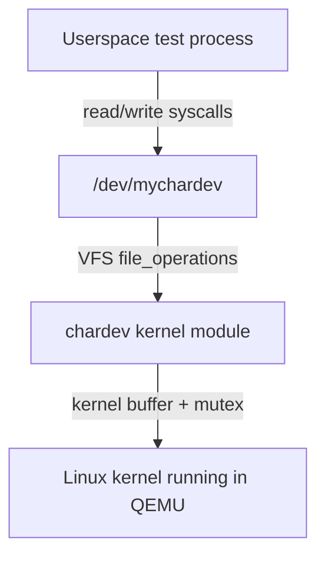
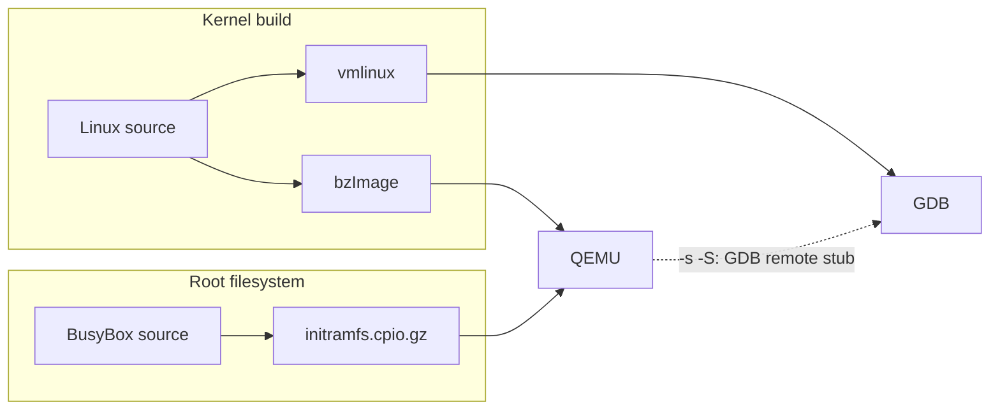

# Linux Kernel Lab

A hands-on Linux systems project covering a custom kernel build, a
BusyBox initramfs, a character-device driver in C, QEMU booting, and GDB
kernel debugging.

## Key outcomes

- Built Linux **6.10** from source and booted it in QEMU with a custom
  BusyBox initramfs.
- Implemented a character-device driver exposing `/dev/mychardev`, with
  read/write communication verified between userspace and the kernel.
- Attached GDB to a paused QEMU instance over its GDB remote stub and
  stopped execution at `start_kernel`, inspecting registers and the
  early-boot call stack.
- Diagnosed and resolved specific compiler, toolchain, kernel-header, and
  QEMU CPU-model incompatibilities encountered along the way (GCC 15/C23,
  BTF tooling, GCC-vs-LLVM/LTO module builds, missing headers, illegal
  instructions under QEMU's default CPU model).
- Built reproducible scripts (`scripts/`) so the whole workflow — from
  dependency check through kernel build, initramfs packaging, QEMU boot,
  GDB attach, and driver smoke test — can be re-run instead of only
  described.

## How the pieces fit together

Userspace-to-kernel communication through the driver:



Build and debug artifact flow:



`bzImage` is what QEMU boots; `vmlinux` is the uncompressed, symbol-bearing
image GDB reads. See [`qemu-gdb/README.md`](qemu-gdb/README.md) for why
both exist and why the debugging workflow needs both.

## Repository structure

```text
kernel-build/     Kernel version, config workflow, config-diff.patch,
                   and documented toolchain issues (no kernel source).
chardev-driver/    The character-device driver, its Makefile, and its own
                   README covering build/load/test/limitations.
qemu-gdb/          QEMU boot + GDB debugging workflow and a real recorded
                   GDB session (notes.md).
scripts/           Reproducible shell scripts for every step: dependency
                   check, kernel build, BusyBox build, initramfs
                   packaging, QEMU boot, GDB debug session, driver
                   smoke test.
docs/              Evidence-collection checklist, architecture decision
                   records, and a placeholder for screenshots/logs.
.github/workflows/ CI: shell/markdown linting and driver-compile checks.
```

## Quick start

None of the kernel or BusyBox source trees are vendored in this
repository — you supply your own checkouts and point the scripts at them.
Every script supports `--help`.

```bash
# 1. Check what's installed
scripts/check-dependencies.sh

# 2. Point at your own source trees (or pass --source/--install-dir flags instead)
export LINUX_SRC=/path/to/linux            # a v6.10 checkout, or your own
export BUSYBOX_SRC=/path/to/busybox

# 3. Build the kernel (see kernel-build/README.md for the config workflow)
scripts/build-kernel.sh --source "$LINUX_SRC" --config /path/to/known-good.config

# 4. Build a static BusyBox (prints the staging dir path on success)
BUSYBOX_INSTALL_DIR="$(scripts/build-busybox.sh --source "$BUSYBOX_SRC" | tail -1)"

# 5. Package the initramfs
scripts/build-initramfs.sh --busybox-dir "$BUSYBOX_INSTALL_DIR"

# 6. Boot it
scripts/run-qemu.sh --kernel <bzImage> --initrd <initramfs.cpio.gz>

# 7. Or boot paused and attach GDB at start_kernel
scripts/debug-kernel.sh --vmlinux <vmlinux> --kernel <bzImage> --initrd <initramfs.cpio.gz>

# 8. Build and smoke-test the driver, separately from the kernel build
cd chardev-driver && make LLVM=1   # or `make` for a GCC build
sudo ../scripts/test-chardev.sh --module ./chardev.ko
```

A top-level `Makefile` wraps the same scripts (`make check|kernel|busybox|initramfs|run|debug|driver|test-driver`) if you prefer `make` to calling scripts directly — run `make help` for the full target list and required environment variables.

Command names, flags, and package availability (`gcc`/`clang`,
`qemu-system-x86_64`, `gdb`, static-libc packages for BusyBox, matching
kernel headers, …) vary by distribution; `scripts/check-dependencies.sh`
reports what's missing but does not install anything — see each script's
`--help` and the relevant `README.md` in `kernel-build/`, `qemu-gdb/`,
and `chardev-driver/` for distribution-specific notes.

## Technical challenges

| Problem | Root cause | Resolution |
|---|---|---|
| Boot decompressor build failure | GCC 15 defaults to a C23-flavored `-std=`, where `bool`/`false`/`true` are reserved keywords, conflicting with the kernel's own pre-C23 definitions in `arch/x86/boot/compressed` | Pinned `-std=gnu11` in `arch/x86/boot/compressed/Makefile` (the same fix later merged upstream) |
| `resolve_btfids` host-tool build failure | Same newer-GCC/`libbpf` incompatibility — `-Werror` on a discarded `const` qualifier | Disabled `CONFIG_DEBUG_INFO_BTF` |
| `radeon`/`i915` GPU driver build failures | Linux 6.10's driver code incompatible with the newer compiler's handling of the `counted_by` attribute | Pruned unused GPU drivers via `make localmodconfig` (not needed for a QEMU-only boot) |
| Out-of-tree module wouldn't build/load | Target distro kernel is built with Clang/LTO; a GCC-built module produces LTO-specific flags (`-mllvm`, `-fsplit-lto-unit`) the running kernel's module loader rejects | Rebuilt the module with `LLVM=1` to match the kernel's own toolchain |
| `/lib/modules/$(uname -r)/build` missing | Running kernel was older than the newly installed headers after a distro update | Rebooted into the kernel the installed headers actually matched |
| `init` panic on QEMU boot ("Attempted to kill init", illegal instruction) | QEMU's default `qemu64` CPU model doesn't expose instruction-set extensions the locally-built toolchain assumed were present | Added `-cpu max` |

Resolved GCC 15/C23, BTF-tooling, GPU-driver, LLVM/LTO module-build,
kernel-header, and QEMU CPU-model incompatibilities — see
[`kernel-build/README.md`](kernel-build/README.md) for the full
narrative and [`qemu-gdb/README.md`](qemu-gdb/README.md) for the
`-cpu max` investigation in more detail.

## What I learned

- Toolchain version drift breaks things in ways that look like kernel
  bugs but aren't — GCC 15 changing its default C standard to C23 broke
  a kernel released before that compiler existed, in more than one place
  in the same build.
- The kernel build system, the out-of-tree module build system, and the
  userspace toolchain all have to agree on compiler and C standard. A
  Clang/LTO-built distro kernel cannot load a GCC-built module.
- QEMU's default CPU model is deliberately conservative and will
  silently mismatch binaries compiled for the host's actual
  microarchitecture — the failure surfaces as an illegal-instruction
  panic in PID 1, not as anything that names the real cause.
- Early boot failures can surface far from their actual cause: an
  instruction-set mismatch in QEMU's CPU model showed up as "Attempted
  to kill init," not as a CPU-feature error.
- Loading an unsigned/out-of-tree module taints the kernel (visible in
  `/proc/sys/kernel/tainted`), which is expected for local development
  but worth understanding before it shows up unexplained in a bug report.

## Limitations

- `chardev-driver` is an educational character driver, not a production
  or hardware driver — no interrupts, DMA, `ioctl`, or per-fd state (see
  [`chardev-driver/README.md`](chardev-driver/README.md) § Known
  limitations).
- Tested only against the specific kernel/compiler combinations
  documented here (Linux 6.10 with GCC 15/16, and separately a Clang/LTO
  distro kernel) — this is not a stable, cross-version kernel API and
  isn't claimed to build unmodified against other kernel releases.
- The `scripts/` never install dependencies automatically; `--help` and
  `check-dependencies.sh` tell you what's missing, you install it.
- A full kernel build takes significant time and disk space (source tree
  plus build output can run into several GB); nothing here shortcuts
  that.
- Screenshots and exact command output will vary by machine — see
  `docs/evidence-checklist.md` and `docs/assets/` for what's been
  collected versus what's still a documented gap.

## Evidence

Screenshots and captured output referenced by this project live under
[`docs/assets/`](docs/assets/README.md). At the time of this update that
directory contains a checklist of what to capture, not populated
screenshots — see [`docs/evidence-checklist.md`](docs/evidence-checklist.md)
for the full list (kernel build output, QEMU boot log, `uname -a`,
driver `dmesg` output, GDB breakpoint/backtrace). The one piece of real,
already-captured evidence in this repository is the GDB session
transcript in [`qemu-gdb/notes.md`](qemu-gdb/notes.md), reproduced with
explanation in [`qemu-gdb/README.md`](qemu-gdb/README.md).

<!-- TODO: add docs/assets/qemu-boot.png once captured -->
<!-- TODO: add docs/assets/chardev-dmesg.png once captured -->
<!-- TODO: add docs/assets/gdb-breakpoint.png once captured -->

## Architecture decision records

Short records of the non-trivial design choices behind this project, in
`docs/adr/`:

- [`0001-use-qemu-for-isolated-kernel-testing.md`](docs/adr/0001-use-qemu-for-isolated-kernel-testing.md)
- [`0002-use-busybox-for-minimal-initramfs.md`](docs/adr/0002-use-busybox-for-minimal-initramfs.md)
- [`0003-build-module-with-matching-toolchain.md`](docs/adr/0003-build-module-with-matching-toolchain.md)

## License

This repository does not currently declare a license. (Recommendation:
add an MIT or Apache-2.0 license if you intend this to be reused —
neither has been added here, since that's a choice for the repository
owner to make, not one to apply silently.)
