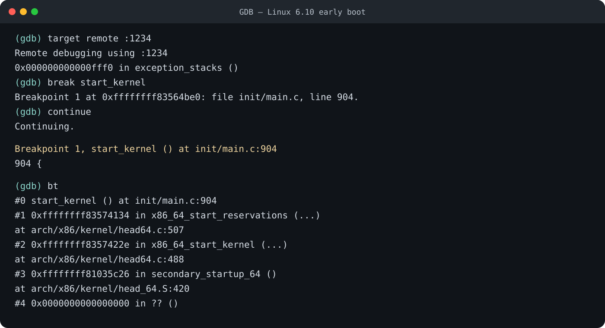

# Linux Kernel Lab

[](https://github.com/nhatminh06/linux-kernel-lab/actions/workflows/ci.yml)

A reproducible systems lab that builds Linux 6.10 and a minimal BusyBox
initramfs, boots them under QEMU, debugs early kernel startup with GDB, and
exercises a message-oriented character-device driver from userspace.



> Evidence: a terminal rendering of the real recorded GDB session in
> [`qemu-gdb/notes.md`](qemu-gdb/notes.md), stopped at `start_kernel()`.

## What this demonstrates

- A custom x86_64 Linux 6.10 kernel booting to a BusyBox shell in QEMU.
- Symbol-aware remote debugging: QEMU starts paused, GDB loads `vmlinux`, and
  execution stops at `start_kernel()` with a readable early-boot backtrace.
- A Linux character driver with a mutex-protected, 16-message FIFO; exact
  payload lengths; partial reads; binary payloads; and clean error unwinding.
- Repeatable scripts for dependency checks, kernel/BusyBox/initramfs builds,
  QEMU boot, GDB attach, and privileged driver tests.
- CI proof for shell and Markdown quality, script behavior, static analysis,
  and compilation against Ubuntu's current generic kernel headers.

## Architecture

```mermaid
flowchart LR
    U[Userspace test] -->|read/write| D[/dev/mychardev]
    D -->|VFS operations| M[Character module]
    M -->|16-message FIFO| K[Linux kernel]
    S[Linux source] --> B[bzImage]
    S --> V[vmlinux + symbols]
    BB[BusyBox] --> I[initramfs]
    B --> Q[QEMU]
    I --> Q
    V --> G[GDB]
    Q -. remote stub .-> G
```

QEMU boots `bzImage`; GDB reads symbols and debug information from `vmlinux`.
The detailed rationale is in [`qemu-gdb/README.md`](qemu-gdb/README.md).

## Quick start

Kernel and BusyBox sources are intentionally not vendored. Each script supports
`--help`, and the top-level `Makefile` exposes equivalent convenience targets.

```bash
scripts/check-dependencies.sh

export LINUX_SRC=/path/to/linux
export BUSYBOX_SRC=/path/to/busybox

scripts/build-kernel.sh --source "$LINUX_SRC" --config /path/to/known-good.config
BUSYBOX_INSTALL_DIR="$(scripts/build-busybox.sh --source "$BUSYBOX_SRC" | tail -1)"
scripts/build-initramfs.sh --busybox-dir "$BUSYBOX_INSTALL_DIR"
scripts/run-qemu.sh --kernel <bzImage> --initrd <initramfs.cpio.gz>
```

For an early-boot debug session:

```bash
scripts/debug-kernel.sh \
  --vmlinux <vmlinux> --kernel <bzImage> --initrd <initramfs.cpio.gz>
```

To build and test the driver against the running kernel:

```bash
make -C chardev-driver LLVM=1  # omit LLVM=1 for a GCC-built kernel
sudo scripts/test-chardev.sh --module chardev-driver/chardev.ko
```

The privileged test covers seven behaviors: round trip, FIFO ordering, embedded
NUL plus partial reads, full-queue rejection, reuse after draining, empty reads,
and clean unloading. It modifies kernel state, so it is deliberately not run by
hosted CI.

## Documentation map

| Area | Details |
|---|---|
| Kernel build | [`kernel-build/README.md`](kernel-build/README.md) |
| Driver design and limits | [`chardev-driver/README.md`](chardev-driver/README.md) |
| QEMU/GDB workflow | [`qemu-gdb/README.md`](qemu-gdb/README.md) |
| Recorded GDB transcript | [`qemu-gdb/notes.md`](qemu-gdb/notes.md) |
| Troubleshooting and lessons | [`docs/technical-notes.md`](docs/technical-notes.md) |
| Design decisions | [`docs/adr/`](docs/adr/) |
| Evidence still worth capturing | [`docs/evidence-checklist.md`](docs/evidence-checklist.md) |

## Scope

This is an educational lab, not a production driver or a stable cross-version
kernel API. The module targets Linux 6.4 or newer because it uses the current
single-argument `class_create()` interface. Builds require matching kernel
headers and a toolchain compatible with the target kernel; a Clang/LTO kernel,
for example, requires an LLVM-built module. No interrupts, DMA, `ioctl`, `mmap`,
wait queues, or per-file state are claimed.

The repository is feature-frozen. Future changes should be limited to verified
compatibility fixes, documentation corrections, and replacement of checklist
items with authentic evidence.

## License

No repository-level license has been selected. The file is intentionally absent
rather than silently choosing legal terms on the owner's behalf.
